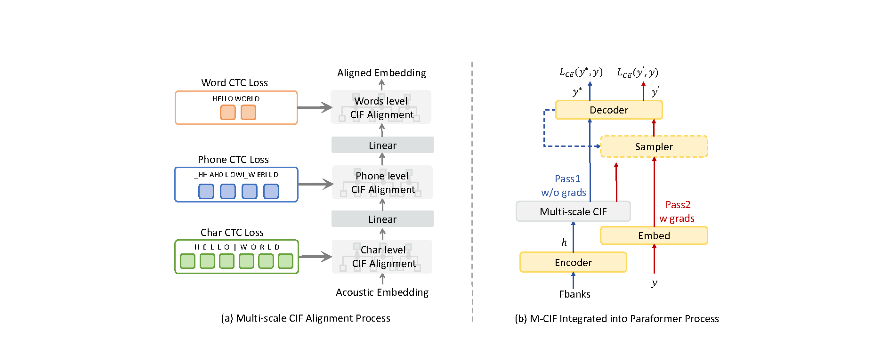

# M-CIF: MULTI-SCALE ALIGNMENT FOR CIF-BASED NON-AUTOREGRESSIVE ASR

## Overview

- This repository is the code of paper "M-CIF: MULTI-SCALE ALIGNMENT FOR CIF-BASED NON-AUTOREGRESSIVE ASR". a method for enhancing Multi-Scale Alignment in CIF-based Non-Autoregressive ASR for English, French, and German. 



- Both model training and inference use the [FunASR](https://github.com/modelscope/FunASR) tool.

The main method code can be found at:  

```
FunASR/funasr/models/paraformer/cif_predictor.py 
FunASR/funasr/models/paraformer/model.py
```

## Installation

- Clone the repository:

```bash
git clone https://github.com/Moriiikdt/M-CIF.git
```

- Requirements

```bash
python>=3.8
torch>=1.13
torchaudio
```

- Install for pypi

```shel
pip3 install -U funasr
```

## Dataset Prepare

- Download your dataset and process it. Here is the format of `Librispeech` dataset. You need to format the data info as this `jsonl` format:

```jsonl
{"key":"460-172359-0000","source":"/LibriSpeech/wav/train-clean-100/460-172359-0000.wav","source_len":791,"target":"it was not until the mining boom at the time when everybody went simply crazy over the cobalt and porcupine mines of the new silver country near the hudson bay","target_len":34,"phone":"IH1 T | W AA1 Z | N AA1 T | AH0 N T IH1 L | DH AH0 | M AY1 N IH0 NG | B UW1 M | AE1 T | DH AH0 | T AY1 M | W EH1 N | EH1 V R IY0 B AA2 D IY0 | W EH1 N T | S IH1 M P L IY0 | K R EY1 Z IY0 | OW1 V ER0 | DH AH0 | K OW1 B AO2 L T | AH0 N D | P AO1 R K Y AH0 P AY2 N | M AY1 N Z | AH1 V | DH AH0 | N UW1 | S IH1 L V ER0 | K AH1 N T R IY0 | N IH1 R | DH AH0 | HH AH1 D S AH0 N | B EY1","char":"i t | w a s | n o t | u n t i l | t h e | m i n i n g | b o o m | a t | t h e | t i m e | w h e n | e v e r y b o d y | w e n t "}
```

- If you need to make the test-related file, run:

```shell
python ./DATA/jsonl2scp.py
```

## Training

- Complete the information according to the prompts in the `run_mcif.sh` file, then

```shell
cd ./FunASR/examples/aishell/paraformer
bash run_mcif.sh
```


## Acknowledgments

- FunASR for the base toolkit
- NiuTrans Team for their contributions and research