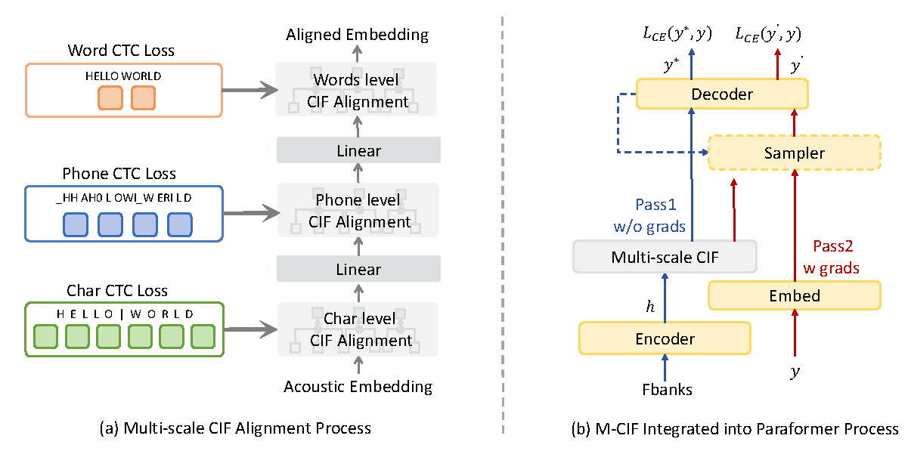

# M-CIF: Multi-Scale Alignment for CIF-based Non-Autoregressive ASR

------

### 📜 Overview

This repository is the official code for the paper **"M-CIF: MULTI-SCALE ALIGNMENT FOR CIF-BASED NON-AUTOREGRESSIVE ASR"**. This method enhances multi-scale alignment in CIF-based non-autoregressive Automatic Speech Recognition (ASR) for English, French, and German.



Both model training and inference are built on the **FunASR** toolkit. The main method code can be found at:

- `FunASR/funasr/models/paraformer/cif_predictor.py`
- `FunASR/funasr/models/paraformer/model.py`

------

### ⚙️ Installation

1. **Clone the repository:**

   ```bash
   git clone https://github.com/Moriiikdt/M-CIF.git
   ```

2. **Install FunASR via pip:**

   ```bash
   pip3 install -U funasr
   ```

### ✅ Requirements

- `python>=3.8`
- `torch>=1.13`
- `torchaudio`

------

### 💾 Dataset Preparation

1. **Download and process your dataset.** The data must be formatted into a `jsonl` file.

2. **Format the data info** as shown in this Librispeech example:

   ```json
   {"key":"460-172359-0000","source":"/LibriSpeech/wav/train-clean-100/460-172359-0000.wav","source_len":791,"target":"it was not until the mining boom at the time when everybody went simply crazy over the cobalt and porcupine mines of the new silver country near the hudson bay","target_len":34,"phone":"IH1 T | W AA1 Z | N AA1 T | AH0 N T IH1 L | DH AH0 | M AY1 N IH0 NG | B UW1 M | AE1 T | DH AH0 | T AY1 M | W EH1 N | EH1 V R IY0 B AA2 D IY0 | W EH1 N T | S IH1 M P L IY0 | K R EY1 Z IY0 | OW1 V ER0 | DH AH0 | K OW1 B AO2 L T | AH0 N D | P AO1 R K Y AH0 P AY2 N | M AY1 N Z | AH1 V | DH AH0 | N UW1 | S IH1 L V ER0 | K AH1 N T R IY0 | N IH1 R | DH AH0 | HH AH1 D S AH0 N | B EY1","char":"i t | w a s | n o t | u n t i l | t h e | m i n i n g | b o o m | a t | t h e | t i m e | w h e n | e v e r y b o d y | w e n t | s i m p l y | c r a z y | o v e r | t h e | c o b a l t | a n d | p o r c u p i n e | m i n e s | o f | t h e | n e w | s i l v e r | c o u n t r y | n e a r | t h e | h u d s o n | b a y"}
   ```

3. **To generate test-related files**, run the provided script:

   ```bash
   python ./DATA/jsonl2scp.py
   ```

------

### 🚀 Training

1. **Configure the training script:** Open the `run_mcif.sh` file and complete the information as prompted.

2. **Navigate to the example directory:**

   ```bash
   cd ./FunASR/examples/aishell/paraformer
   ```

3. **Launch the training:**

   ```bash
   bash run_mcif.sh
   ```

------

###  Acknowledgments

A special thanks to the following teams for their invaluable work:

- **FunASR** for providing the base toolkit.
- **NiuTrans Team** for their contributions and research.